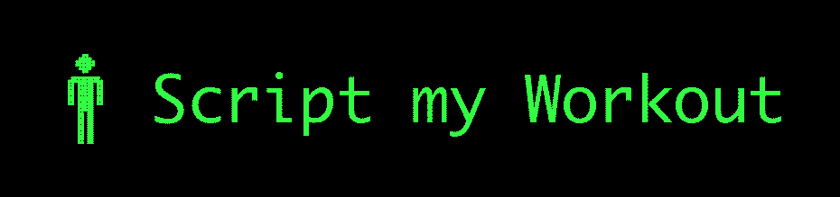
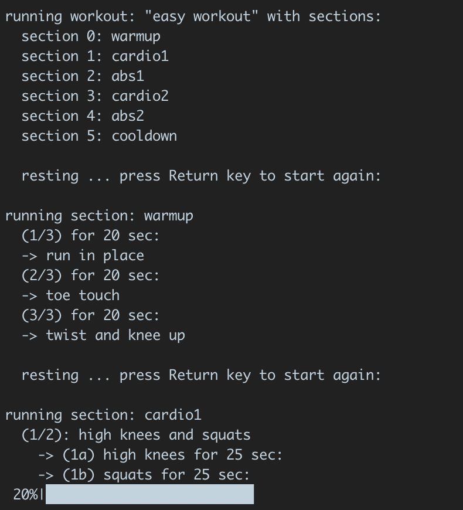

# Script My Workout

Create your own terminal-based workouts!



## What is it

'Script My Workout' is a framework that lets you define and run your own workout exercise programs, which run right in the terminal.

Each `workout` is comprised of different `sections`, which contain a list of `exercises` and a `routine`, which is a function that runs through them in a user-defined sequence.

When running each `section`, the program prints information to the terminal and narrates the process out loud for you to follow along with.



## How to install

Run the following commands

    git clone https://github.com/twhughes/Script_My_Workout.git
    cd Script_My_Workout
    pip install -e .

You can test if it worked by running one of the example workouts

    python -m workout examples/easy.yaml

## How to use

There are two ways to define workouts:

### YAML file

The simplest way is to define a workout in a YAML file.

For example, the following yaml file `examples/easy.yaml` defines a simple workout:

```yaml
name: easy workout

sections:

  section1:
    name: warmup
    routine: one_min_each
    exercises:
      - toe touch
      - run in place

  section2:
    name: HIT
    routine: abab_25
    exercises:
      - jumping jacks
      - burpees
      - push ups
      - high knees

  section3:
    name: cooldown
    routine: one_min_each
    exercises:
      - hamstring stretch
      - cobra stretch
```

And one can run this file with

    python -m workout examples/easy.yaml

There are a few other example files in the `examples/` directory.


### Python Script

For a bit more customization, one can also write a workout script in python.

Here's an example script that defines and runs a simple workout.

```python
# import basic things you need from the package + routines and exercises
from workout import workout, section
from workout.exercises import warmup_exercises, hit_exercises, cooldown_exercises
from workout.routines import one_min_each, abab_25

# define the different `sections` of your workout with a list of exercises and a routine for running them
warmup   = section(name='warmup',   exercises=warmup_exercises,   routine=one_min_each)
hit      = section(name='HIT',      exercises=hit_exercises,      routine=abab_25)
cooldown = section(name='cooldown', exercises=cooldown_exercises, routine=one_min_each)

# create a workout defined by a list of sections
hard_workout = workout(name='easy', sections=[warmup, hit, cooldown])

# run the workout
hard_workout.run()
```

For an example, run the script `simple_script.py`.

    python examples/simple_script.py

## Customizing your own workouts.

Workouts are fully customizable by editing the files in the `workout/` directory.

1.  Define lists of exercises in `workout/exercises.py`, which define the categories of exercise you want to perform.

2.  Make routines in `workout/routines.py`, which define how to run through your excercises.

3.  Group your exercises and routines into 'sections' using `workout/sections.py`.

4.  Combine sections together to form daily workouts in `workout/workouts.py`.

## Features Coming soon

- [x] Workout definition through YAML file.
- [x] Progress bar display.
- [ ] Trainers with different personalities.
- [ ] Customizable command line interface (define workout via command line arguments)
- [ ] More sophisticated definition of exercises (difficulty, categories, etc.)
- [ ] Randomization of workouts (choose amount of time and difficulty -> generate exercise list)
- [ ] ASCII art for each exercise.

I fully welcome contributions or ideas for new features or improvements!  Please leave an issue or pull request if you want to make any contributions.

## Credit

Copyright (2020) Tyler Hughes
Logo by Nadine Gilmer @nagilmer


